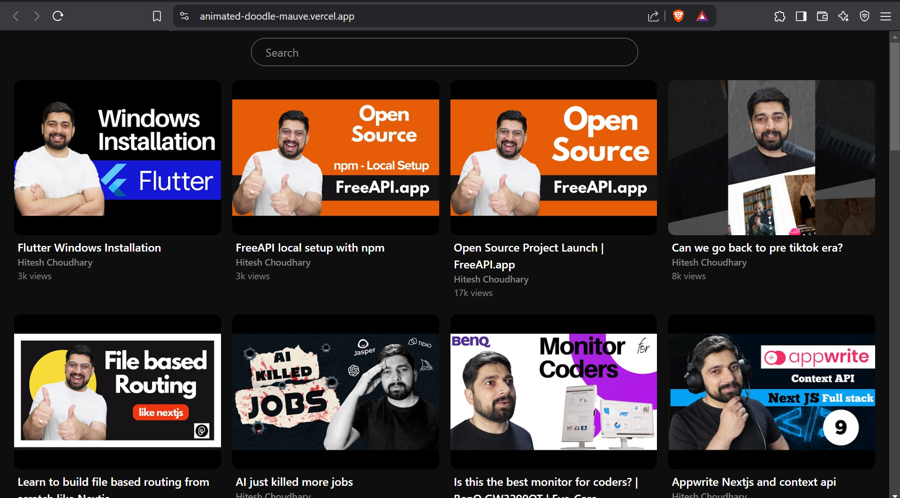
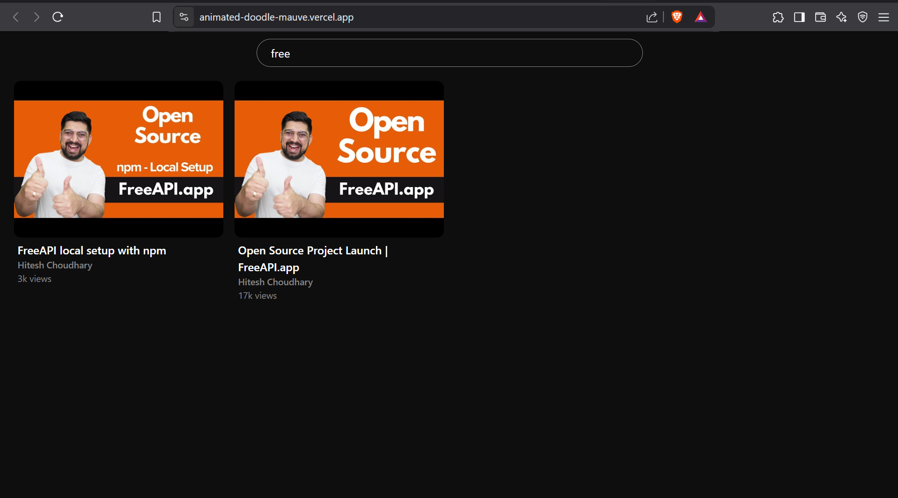

# youtube video listing

This project aims to build a **YouTube-style video listing page** that fetches and displays YouTube videos from the FreeAPI YouTube endpoint. The page allows users to view video thumbnails, titles, and channel names, with the ability to click on a video to open it in YouTube. Additionally, it includes a search bar that filters the displayed videos based on the title, providing a user-friendly and dynamic experience.

---

## Features

- **Video Listing**: Fetch and display a list of YouTube videos using the FreeAPI endpoint.
- **Video Thumbnails, Titles, and Channel Names**: Each video is displayed with its thumbnail, title, and channel name.
- **Clickable Videos**: Clicking on any video takes the user to YouTube to watch the video.
- **Search Functionality**: A search bar allows users to filter videos based on the title (front-end filtering without additional API calls).
- **Responsive Design**: The application is fully responsive, providing a seamless user experience on both desktop and mobile devices.
- **Grid Layout**: Videos are displayed in a neat grid layout for better UI/UX.

---

## API Endpoint

The application fetches video data from the following API endpoint:

- **GET**: `https://api.freeapi.app/api/v1/public/youtube/videos`


---

## Technologies Used

- **Frontend**:
  - HTML
  - CSS
  - JavaScript
  - Fetch API (for fetching video data)
  - Debouncing for search input (to optimize performance)
- **Responsive Layout**: Grid layout using CSS Flexbox
- **Debounce Function**: To limit the number of times the filter function is triggered while typing in the search bar.

---

## How to Run the Project

1. **Clone the repository**:
   ```bash
   git clone https://github.com/vekariaayush04/animated-doodle.git
   ```

2. **Navigate to the project folder**:
   ```bash
   cd animated-doodle
   ```

3. **Open the `index.html` file** in a browser to view the application.

4. The application will automatically fetch and display videos from the FreeAPI YouTube endpoint. You can use the search bar to filter the videos.

---

## Screenshots






---

## Deployment

The application is deployed and can be accessed online at:

https://animated-doodle-mauve.vercel.app/

---

## Contribution

Feel free to fork this project, make changes, and create pull requests. Contributions are welcome!
